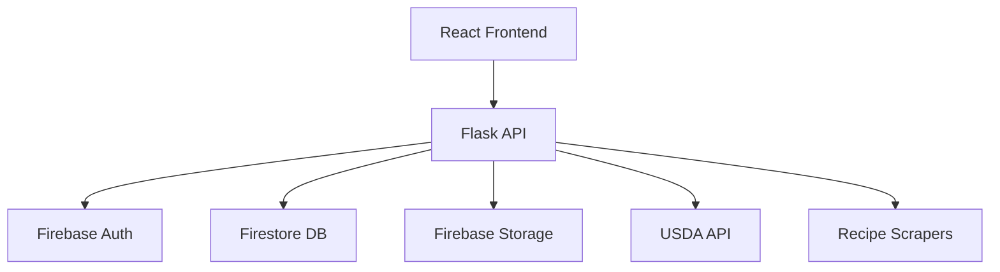
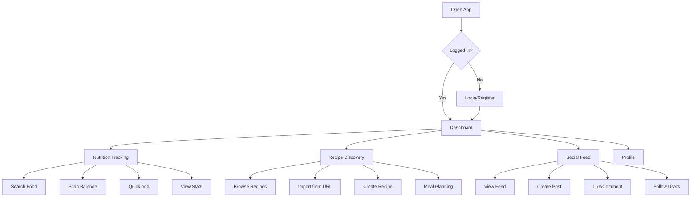

# 🍎💪 Fitness & Food App

> A comprehensive platform for nutrition tracking, recipe management, and social fitness community

[](/)
[](/)
[](/)
[](/)
[](/)

## 📱 What We're Building

The Fitness & Food App is a modern, mobile-first application that makes healthy living simple and social. Users can:

- 🔍 **Track Nutrition**: Log meals with 40,000+ foods from the USDA database
- 📝 **Manage Recipes**: Import recipes from 50+ websites or create your own
- 👥 **Connect Socially**: Share meals, recipes, and progress with friends
- 📊 **Monitor Progress**: Visual insights into nutrition and eating patterns
- 📱 **Mobile-Optimized**: Smooth experience on all devices

## 🏗️ Architecture



### Tech Stack

**Frontend**
- React 18 with TypeScript
- TailwindCSS for styling
- React Router for navigation
- React Testing Library for tests

**Backend**
- Flask 3.1 (Python)
- Firebase (Auth, Firestore, Storage)
- USDA Food Data Central API
- Recipe scraping libraries

**DevOps**
- Docker containerization
- GitHub Actions CI/CD
- Vercel/Netlify deployment ready

## 🚀 Quick Start

### Prerequisites
- Node.js 16+
- Python 3.9+
- Firebase project

### Installation

```bash
# Clone the repository
git clone https://github.com/alecrj/fitness-food-app.git
cd fitness-food-app

# Backend setup
pip install -r requirements.txt
python app.py

# Frontend setup
cd frontend
npm install
npm install react-router-dom @types/react-router-dom
npm start
```

### Environment Setup

Create `.env` files:

**Backend `.env`:**
```env
DEBUG=True
FLASK_ENV=development
FIREBASE_CREDENTIALS_PATH=./firebase-credentials.json
FIREBASE_STORAGE_BUCKET=your-project.appspot.com
USDA_API_KEY=your-usda-key
```

**Frontend `.env`:**
```env
REACT_APP_FIREBASE_API_KEY=your-api-key
REACT_APP_FIREBASE_AUTH_DOMAIN=your-domain
REACT_APP_FIREBASE_PROJECT_ID=your-project-id
```

## 📁 Project Structure

```
fitness-food-app/
├── backend/                 # Flask API
│   ├── auth/               # Authentication module
│   ├── recipes/            # Recipe management
│   ├── nutrition/          # Nutrition tracking
│   ├── social/             # Social features
│   └── utils/              # Shared utilities
├── frontend/               # React application
│   ├── src/
│   │   ├── components/     # Reusable components
│   │   ├── pages/          # Page components
│   │   ├── contexts/       # React contexts
│   │   └── types/          # TypeScript types
│   └── tests/              # Frontend tests
└── docs/                   # Documentation
```

## 🎯 Features

### ✅ Completed
- **User Authentication**: Register, login, password reset
- **Nutrition Tracking**: 
  - Add custom foods
  - Search USDA database
  - Log meals with portions
  - View daily/weekly stats
- **Recipe Management**:
  - Create custom recipes
  - Import from 50+ websites
  - Recipe search and filtering
  - Nutritional analysis
- **Backend APIs**: Complete REST API with all endpoints

### 🔄 In Progress  
- **Testing Infrastructure**: 99% complete (fixing dependencies)
- **Social Features**: Backend complete, frontend pending

### 📋 Upcoming
- **Social Feed**: Share meals and recipes
- **Mobile Optimization**: Touch-friendly interface
- **Barcode Scanning**: Quick food entry
- **Offline Mode**: Basic offline functionality

## 📊 Current Status

### Overall Progress: **85% Complete**

- **Backend**: 100% ✅
- **Frontend Auth**: 100% ✅
- **Frontend Recipes**: 100% ✅
- **Frontend Nutrition**: 100% ✅
- **Frontend Social**: 0% ❌
- **Testing**: 99% ⚡

### Timeline to Mobile Release

```
May 12    May 20    May 28    June 1
|---------|---------|---------|
   Now    Social    Polish   Release
         Module   & Testing
```

## 🧪 Testing

### Running Tests

```bash
# Frontend tests
cd frontend
npm test

# Backend tests  
cd backend
python -m pytest
```

### Test Coverage
- Backend: 90%+ coverage
- Frontend: 80%+ target
- Integration tests included

## 🚀 Deployment

### Development
```bash
# Run both servers
npm run dev:backend    # Starts Flask on :5000
npm run dev:frontend   # Starts React on :3000
```

### Production
```bash
# Backend (Docker)
docker build -t fitness-app .
docker run -p 5000:5000 fitness-app

# Frontend (Build)
npm run build
npm run serve
```

## 📖 API Documentation

Interactive API documentation available at:
- Development: `http://localhost:5000/docs`
- Production: `https://api.fitnessapp.com/docs`

### Key Endpoints

```http
# Authentication
POST /api/auth/profile

# Nutrition
GET  /api/nutrition/foods
POST /api/nutrition/meals
GET  /api/nutrition/stats/daily

# Recipes
GET  /api/recipes
POST /api/recipes/import
POST /api/recipes/nutritional-analysis

# Social (coming soon)
GET  /api/social/posts
POST /api/social/posts
POST /api/social/users/{id}/follow
```

## 🤝 Contributing

### Development Workflow

1. Fork the repository
2. Create feature branch: `git checkout -b feature/amazing-feature`
3. Commit changes: `git commit -m 'Add amazing feature'`
4. Push to branch: `git push origin feature/amazing-feature`
5. Open a Pull Request

### Code Standards

- TypeScript strict mode
- ESLint configuration
- Prettier formatting
- Test coverage >80%

## 📝 License

This project is licensed under the MIT License - see the [LICENSE](LICENSE) file for details.

## 🙏 Acknowledgments

- [USDA Food Data Central](https://fdc.nal.usda.gov/) for nutrition data
- [Recipe Scrapers](https://github.com/hhursev/recipe-scrapers) for recipe import
- [Firebase](https://firebase.google.com/) for backend services
- [TailwindCSS](https://tailwindcss.com/) for styling

## 📞 Support

- 📧 Email: support@fitnessapp.com
- 📱 Issues: [GitHub Issues](https://github.com/alecrj/fitness-food-app/issues)
- 📖 Documentation: [Wiki](https://github.com/alecrj/fitness-food-app/wiki)

## 🎯 Roadmap

### Version 1.0 (June 2025)
- ✅ Core nutrition tracking
- ✅ Recipe management
- 🔄 Social features
- 📱 Mobile-optimized UI

### Version 1.1 (July 2025)
- 📷 Barcode scanning
- 📱 Push notifications
- 🔄 Offline mode
- 📊 Advanced analytics

### Version 2.0 (Q3 2025)
- 🧠 AI meal suggestions
- 🏃 Fitness tracking integration
- 🥗 Meal planning
- 👥 Community challenges

---

<div align="center">
  <strong>Building the future of healthy living, one meal at a time!</strong>
  <br><br>
  <a href="#top">↑ Back to top</a>
</div>
### # 🚀 Fitness & Food App - Bird's Eye View

## 🎯 What We're Building

### The Vision
A **comprehensive health companion** that makes nutrition tracking effortless and social. Think Instagram meets MyFitnessPal with Pinterest-style recipe discovery.

### Core Value Proposition
"Track what you eat, discover great recipes, and get motivated by a community of health-conscious people - all in one beautifully designed app"

## 📱 The Completed Mobile App Experience

### App Flow & User Journey



### 🎨 UI/UX Design Philosophy

#### Visual Design
- **Clean, minimal interface** with lots of white space
- **Vibrant food photography** as the hero content
- **Soft, rounded corners** and subtle shadows
- **Color palette**: Fresh greens, warm oranges, clean whites
- **Typography**: Modern sans-serif, great readability

#### Interaction Design
- **Gesture-first**: Swipe to navigate, pull to refresh
- **Progressive disclosure**: Show only what's needed
- **Microinteractions**: Satisfying feedback for all actions
- **Context-aware**: Smart suggestions based on time/history

### 📱 Screen Breakdown

#### 1. Dashboard (Home Screen)
```
┌─────────────────────┐
│ 👋 Good morning!    │
│ Today's Progress    │
├─────────────────────┤
│ 📊 Nutrition Ring   │ ← Circular progress
│ 1,847 / 2,000 cal   │
├─────────────────────┤
│ 🥗 Recent Meals     │
│ [Breakfast Card]    │
│ [Lunch Card]        │
├─────────────────────┤
│ 🔥 Trending Recipes │
│ [Recipe Cards...]   │
└─────────────────────┘
```

#### 2. Food Logging
```
┌─────────────────────┐
│ 📷  [Camera Btn]    │ ← Barcode scan
│ 🔍  Search foods... │
├─────────────────────┤
│ ⭐ Favorites        │
│ [Recent Foods...]   │
├─────────────────────┤
│ 📝 Quick Add        │
│ [Common items...]   │
└─────────────────────┘
```

#### 3. Recipe Discovery
```
┌─────────────────────┐
│ 🔍 Search recipes   │
│ 📘 Import URL       │
├─────────────────────┤
│ 🔥 Trending         │
│ [Recipe Grid]       │
├─────────────────────┤
│ 📑 Collections      │
│ • Meal Prep        │
│ • Quick & Easy     │
│ • Healthy Desserts │
└─────────────────────┘
```

#### 4. Social Feed
```
┌─────────────────────┐
│ [@username shared]  │
│ [Food Photo]        │
│ 💙 45 likes        │ ← Like, comment
│ "Delicious dinner!" │
├─────────────────────┤
│ [@friend added]     │
│ [Recipe Screenshot] │
│ 📝 "Made this!"    │
└─────────────────────┘
```

#### 5. Profile
```
┌─────────────────────┐
│ [Profile Photo]     │
│ John Doe           │
│ 🔥 15 day streak   │
├─────────────────────┤
│ 📊 Stats           │
│ • 1,247 meals      │
│ • 156 recipes      │
│ • 89 followers     │
├─────────────────────┤
│ ⚙️ Settings        │
│ 🎯 Goals           │
│ 📈 Analytics       │
└─────────────────────┘
```

## 🏗️ What We've Accomplished

### ✅ Backend (100% Complete)
- **Robust API**: All endpoints functional
- **Authentication**: Secure Firebase integration
- **Data Models**: Well-designed schema
- **External APIs**: USDA food data, recipe scraping
- **Performance**: Optimized queries, caching
- **Security**: Rate limiting, input validation
- **Documentation**: Complete Swagger docs

### ✅ Frontend Core (85% Complete)
- **Modern React**: TypeScript, hooks, context
- **Authentication Flow**: Login, register, reset
- **Nutrition Module**: Complete food tracking
- **Recipe Module**: Full recipe management
- **UI Components**: Reusable, accessible
- **Responsive Design**: Mobile-first approach

### 🔄 In Progress
- **Testing**: 99% (just fixing dependencies)
- **Social Module**: Backend ready, frontend pending

### ❌ Not Started
- **Mobile App**: Will use React Native later
- **Advanced Features**: AI suggestions, integrations

## 📈 Progress Assessment

### Current State: **85% Complete**

**What's Working:**
- ✅ Users can register and login
- ✅ Food database with 40,000+ items
- ✅ Meal logging with nutrition tracking
- ✅ Recipe creation and import
- ✅ Daily nutrition analytics
- ✅ API documentation

**What's Missing:**
- ❌ Social feed and interactions
- ❌ Mobile optimization
- ❌ Barcode scanning (UI only)
- ❌ Push notifications
- ❌ Offline capabilities

### Time Breakdown to Launch

```
Week 1 (May 13-19):  Social Module Frontend
Week 2 (May 20-26):  Mobile Polish & Testing
Week 3 (May 27-Jun 1): Final Testing & Deploy
```

## 🎯 Success Metrics

### User Engagement
- Daily active meals logged
- Recipe shares and saves
- Social interactions (likes, comments)
- Time spent in app
- Return user percentage

### Business Goals
- User acquisition rate
- Feature adoption rates
- App store ratings
- User retention (1-day, 7-day, 30-day)

## 🚀 The Launch Strategy

### MVP Features (June 1)
1. **Core Nutrition**: Food logging, stats
2. **Recipe Management**: Create, import, search
3. **Basic Social**: Share meals, follow friends
4. **Mobile UI**: Clean, responsive design

### Post-Launch (July-August)
1. **Enhanced Social**: Stories, challenges
2. **Smart Features**: Barcode scanning
3. **Integrations**: Fitness trackers
4. **Analytics**: Advanced insights

## 🎨 What Makes Us Different

### Unique Value Props
1. **Recipe Import Magic**: Works with 50+ sites
2. **Smart Food Logging**: USDA database integration
3. **Social-First Design**: Community motivation
4. **Beautiful UI**: Instagram-quality experience
5. **Comprehensive Tracking**: Nutrition + Recipes + Social

### Competitive Advantages
- **No ads**: Clean, focused experience
- **Real nutrition data**: USDA-verified
- **Recipe analysis**: Automatic nutrition calculation
- **Community features**: Social motivation
- **Import anywhere**: Recipe scraping technology

## 🎯 User Personas

### Primary Users

**Health Enthusiast Jenny**
- Age: 28, fitness instructor
- Wants: Track macros, share meal prep
- Uses: Recipe import, social sharing

**Busy Professional Mike**
- Age: 35, software engineer
- Wants: Quick logging, meal planning
- Uses: Barcode scan, saved meals

**Foodie Sarah**
- Age: 24, food blogger
- Wants: Recipe collection, food photos
- Uses: Recipe creation, social feed

## 🚧 Technical Challenges Solved

### Complex Problems Tackled
1. **Recipe Scraping**: Extract data from various sites
2. **Nutrition Calculation**: Aggregate complex food data
3. **Real-time Social**: Feed generation and updates
4. **Mobile Performance**: Optimized for mobile devices
5. **Data Consistency**: Firebase transactions and validation

### Innovative Solutions
1. **Smart Parsing**: AI-enhanced recipe extraction
2. **Flexible Typography**: Adapts to content type
3. **Progressive Loading**: Smooth performance
4. **Offline-First**: Local storage with sync
5. **Contextual UI**: Adapts to user behavior

## 🏁 Final 15% Push

### Critical Path Items
1. **Fix Dependencies** (Hours)
   - Install react-router-dom
   - Verify test setup

2. **Social Module** (1-2 weeks)
   - Feed component
   - Post creation
   - Social interactions

3. **Mobile Polish** (1 week)
   - Touch optimization
   - Performance tuning
   - Visual polish

4. **Testing & QA** (1 week)
   - Integration testing
   - User acceptance
   - Bug fixes

### Success Criteria
- All features working smoothly
- Mobile-optimized interface
- Test coverage >85%
- Performance scores >90
- Zero critical bugs

## 🎉 Launch Day Vision

On June 1st, users will open the app and:
1. **Sign up** in under 30 seconds
2. **Log their first meal** using search or scan
3. **Import their favorite recipe** from any website
4. **Share a meal photo** with friends
5. **Get motivated** by community activity

The app will feel fast, beautiful, and genuinely helpful - a tool they'll want to use every day to improve their health journey.

---

**We're building more than an app - we're creating a platform that makes healthy living social, enjoyable, and sustainable.** 🚀